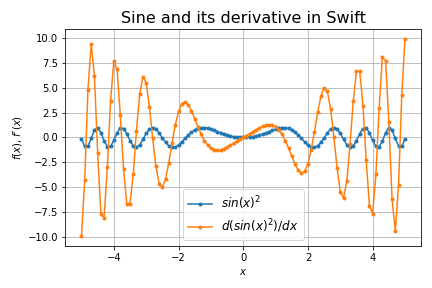
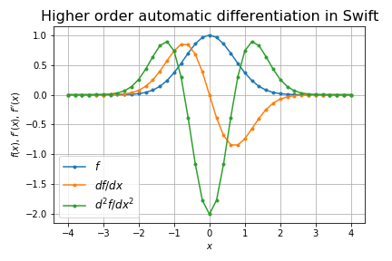
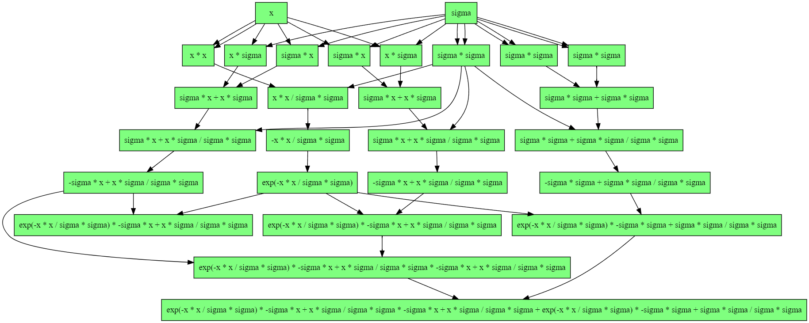

# swigrad

Autograd in swift

## Overview

We implemented autograd in [Rust](https://github.com/msakuta/rustograd), [Zig](https://github.com/msakuta/zigrad) and [Scala](https://github.com/msakuta/scagrad).
Inspired by [Tsoding](https://www.youtube.com/watch?v=LTP5c4NqA8k&ab_channel=TsodingDaily), now it's time for swift.

There are 2 files in this repo

* `main.swift` - A simple implementation with raw enum. Easy to read and understand, not very useful.
* `tape.swift` - A tape implementation which has more advanced features, such as reverse mode, higher order and dot file export.

## Examples

* Sine wave ($\sin(x^2)$)

* Gaussian and its higher order derivatives

* Graph visualization with graphviz

## How to run

I don't own a Mac, so I used docker image for Swift.

Start the docker image:

    docker run -it -v $(pwd):/work swift /bin/bash

Run the script:

    cd /work
    swift tape.swift

## How to compile

Run the docker image:

    docker run -it -v $(pwd):/work swift /bin/bash

Compile the script:

    cd /work
    swiftc tape.swift

Note that the executable built by this command requires Swift runtime libraries, so it cannot run outside the docker container.
It is pretty much useless as a redistributable binary.
The only case I can think of this pre-built binary is to measure performance excluding compilation time.
