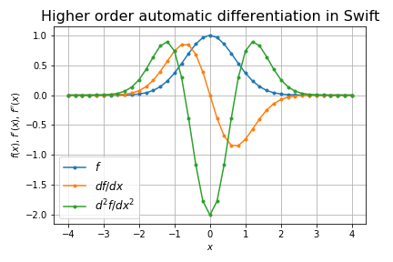

# swigrad

Autograd in swift

## Overview

We implemented autograd in [Rust](https://github.com/msakuta/rustograd), [Zig](https://github.com/msakuta/zigrad) and [Scala](https://github.com/msakuta/scagrad).
Now it's time for swift.

## Examples

* Sine wave ($\sin(x^2)$)

* Gaussian and its higher order derivatives

